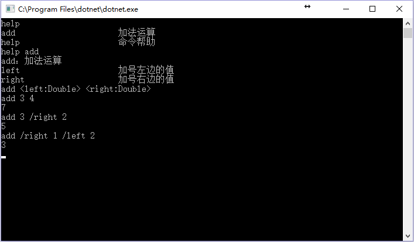

# CommandLine 1.0
CommandLine可以帮助开发者快速构建命令行命令，并在各种控制台环境下使用。

## 如何使用
### 编写命令

    [Command("add", Descrption = "加法运算")]
    public class AddCommand : ICommand
    {
        [CommandParameter("left", IsDefault = true, IsRequired = true, Description = "加号左边的值", Order = 0)]
        public double Left { get; set; }
    
        [CommandParameter("right", IsDefault = true, IsRequired = true, Description = "加号右边的值", Order = 1)]
        public double Right { get; set; }
    
        public void Invoke(ICommandContext context)
        {
            context.WriteLine((Left + Right).ToString());
        }
    }
### 控制台调用命令

    class Program
    {
        static void Main(string[] args)
        {
            //实例化控制台命令上下文
            ConsoleCommandContext context = new ConsoleCommandContext(null);
            //实例化命令提供器
            CommandProvider provider = new CommandProvider();
            //添加命令
            provider.AddCommand<AddCommand>();
            provider.AddCommand<HelpCommand>();
            context.CommandProvider = provider;
            //实例化命令解释器
            CommandParser parser = new CommandParser(context, provider);
            while (true)
            {
                var cmd = Console.ReadLine();
                if (cmd.Trim().ToLower() == "quit")
                    break;
                //解释与执行命令
                parser.ParseAndRun(cmd);
            }
        }
    }
### 控制台使用

## 许可证
[MIT](LICENSE)